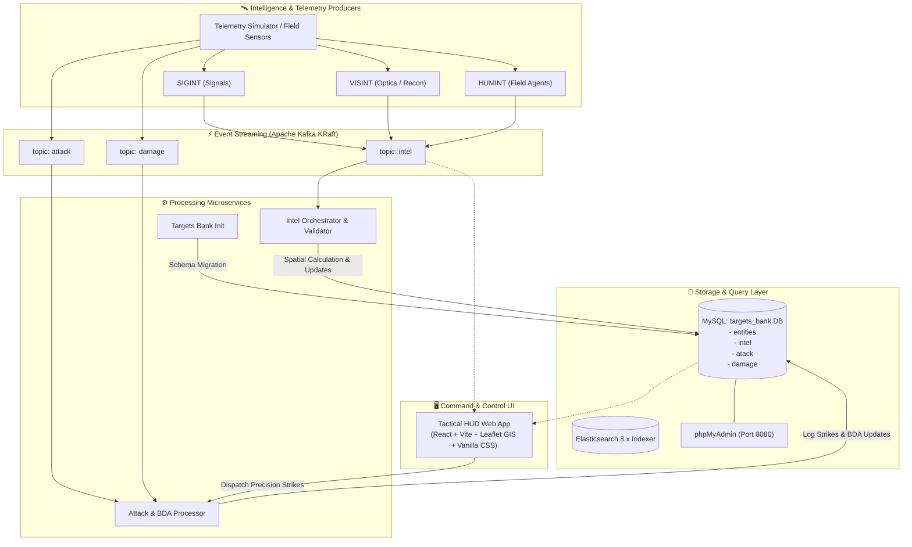

# 🎯 DigitalHunter — Tactical Threat Intelligence & Strike Command Platform

**DigitalHunter** is an end-to-end distributed tactical defense and real-time intelligence gathering, target bank management, and precision strike coordination system.

The system ingests multi-source intelligence telemetry signals (`SIGINT`, `VISINT`, `HUMINT`) across an event-driven **Apache Kafka** pipeline, applies validation and geospatial distance calculations (Haversine formula), maintains a persistent relational **MySQL** target bank state, tracks battle damage assessments (BDA), and delivers a command-center **Web Tactical HUD UI** with interactive GIS mapping.

---

## 📑 Table of Contents

- [System Architecture & Data Flow](#-system-architecture--data-flow)
- [Key Features & Modules](#-key-features--modules)
- [Tech Stack](#-tech-stack)
- [Data Models & Schema](#-data-models--schema)
- [Kafka Topics & Message Payloads](#-kafka-topics--message-payloads)
- [Project Directory Structure](#-project-directory-structure)
- [Getting Started & Installation](#-getting-started--installation)
  - [1. Prerequisites](#1-prerequisites)
  - [2. Starting Backend Services with Docker](#2-starting-backend-services-with-docker)
  - [3. Running the Kafka Telemetry Simulator](#3-running-the-kafka-telemetry-simulator)
  - [4. Launching the Tactical Web UI](#4-launching-the-tactical-web-ui)
- [Web UI Overview & Controls](#-web-ui-overview--controls)
- [Service Configuration & Environment Variables](#-service-configuration--environment-variables)
- [Troubleshooting & Verification](#-troubleshooting--verification)

---

## 🏗 System Architecture & Data Flow



---

## 🌟 Key Features & Modules

1. **Target Bank Management (`targets_bank`)**:
   - Central repository of identified tactical entities (Convoy Alpha, Depot Bravo, Launcher Delta, etc.).
   - Tracks threat class (`mobile_vehicle`, `infrastructure`, `human_squad`, `launcher`), dynamic coordinates, priority levels (P1 to P5), and lifecycle status (`active`, `damaged`, `destroyed`, `strike_pending`).

2. **Real-Time Intel Ingestion & Validation (`intel`)**:
   - Multi-source intelligence signal consumer (`SIGINT`, `VISINT`, `HUMINT`).
   - Structural and schema validation on incoming Kafka messages.
   - Calculates target distance from Base HQ using the **Haversine formula**.
   - Maintains coordinate drift history and updates existing entities or registers new targets dynamically.

3. **Strike Operations & Battle Damage Assessment (`attack`)**:
   - Logs precision air strike dispatches with weapon specifications (`AGM-114 Hellfire`, `GBU-39 SDB`, `Delilah Missile`, `SPICE-250`, `Popeye AGM`, `Griffin LGM`).
   - Ingests post-strike BDA imagery assessments (`destroyed`, `damaged`, `no_damage`) and updates entity statuses.

4. **Tactical Telemetry Simulator (`producer/simulator.py`)**:
   - High-throughput Kafka producer with coordinate jitter simulation, realistic target mobility, and noise/error injection testing capabilities.

5. **Tactical Command HUD & GIS Map (`ui`)**:
   - Modern dark glassmorphic military interface with Web Audio API sound effects.
   - Interactive GIS radar map with glowing priority markers, HQ defense range rings (50km/100km), and movement vectors.
   - Live Kafka telemetry stream visualizer with play/pause and 1x-5x playback speed.
   - Automated ordnance recommendation engine matched to target class.

---

## 🛠 Tech Stack

| Layer | Technology | Details |
|---|---|---|
| **Event Broker** | Apache Kafka 7.8 (KRaft mode) | Topic streaming on port `9092` |
| **Relational Database** | MySQL 8.x | Database `targets_bank` on port `3306` |
| **Search & Indexing** | Elasticsearch 8.12 | Port `9200` |
| **Backend Services** | Python 3.10+ | `kafka-python`, `mysql-connector-python` |
| **Frontend Framework** | React 18 + Vite | Port `5173` |
| **GIS Mapping** | Leaflet.js / React-Leaflet | Dark CartoDB vector basemap |
| **Styling** | Vanilla CSS | Custom design tokens, glassmorphism, HUD animations |
| **Containerization** | Docker & Docker Compose | Multi-container orchestrated setup |

---

## 🗄 Data Models & Schema

The database is initialized under the `targets_bank` database in MySQL:

### 1. `entities` Table
Stores known and newly discovered tactical targets.
```sql
CREATE TABLE IF NOT EXISTS entities (
    id VARCHAR(20) PRIMARY KEY,
    reported_lat DECIMAL(20, 20),
    reported_lon DECIMAL(20, 20),
    priority_level INT,
    distance DECIMAL(20, 20),
    status VARCHAR(30)
);
```

### 2. `intel` Table
Stores raw incoming signal telemetry events.
```sql
CREATE TABLE IF NOT EXISTS intel (
    signal_id VARCHAR(100) PRIMARY KEY,
    timestamp DATE,
    entity_id VARCHAR(20),
    reported_lat DECIMAL(20, 20),
    reported_lon DECIMAL(20, 20),
    signal_type VARCHAR(20),
    priority_level INT
);
```

### 3. `atack` Table
Records launched air strikes and weapon systems utilized.
```sql
CREATE TABLE IF NOT EXISTS atack (
    attack_id VARCHAR(100) PRIMARY KEY,
    entity_id VARCHAR(100),
    weapon_type VARCHAR(30)
);
```

### 4. `damage` Table
Tracks evaluated post-attack Battle Damage Assessments (BDA).
```sql
CREATE TABLE IF NOT EXISTS damage (
    id INT PRIMARY KEY AUTO_INCREMENT,
    attack_id VARCHAR(100),
    entity_id VARCHAR(100),
    result VARCHAR(30)
);
```

---

## 📨 Kafka Topics & Message Payloads

### 1. Topic: `intel`
```json
{
  "timestamp": "2026-08-30T13:45:00.123456+00:00",
  "signal_id": "9b1deb4d-3b7d-4bad-9bdd-2b0d7b3dcb6d",
  "entity_id": "TGT-001",
  "reported_lat": 31.5204,
  "reported_lon": 34.4512,
  "signal_type": "SIGINT",
  "priority_level": 1
}
```

### 2. Topic: `attack`
```json
{
  "timestamp": "2026-08-30T13:46:12.000000+00:00",
  "attack_id": "atk-7731-01",
  "entity_id": "TGT-004",
  "weapon_type": "AGM-114 Hellfire"
}
```

### 3. Topic: `damage`
```json
{
  "timestamp": "2026-08-30T13:46:45.000000+00:00",
  "attack_id": "atk-7731-01",
  "entity_id": "TGT-004",
  "result": "destroyed"
}
```

---

## 📁 Project Directory Structure

```
DigitalHunter/
├── docker-compose.yaml        # Multi-container service definitions
├── README.md                  # System documentation
├── targets_bank/              # Schema migration & target store service
│   ├── Dockerfile
│   ├── requirements.txt
│   └── app/
│       ├── main.py
│       ├── mysql_connection.py
│       └── utils.py
├── intel/                     # Intelligence signal processor & validator
│   ├── Dockerfile
│   ├── requirements.txt
│   └── app/
│       ├── consumer.py
│       ├── dal.py
│       ├── haversine.py
│       ├── logger.py
│       ├── main.py
│       ├── mysql_connection.py
│       ├── orchestrator.py
│       ├── producer.py
│       └── validations.py
├── attack/                    # Strike execution & BDA consumer
│   ├── Dockerfile
│   ├── requirements.txt
│   └── app/
│       ├── consumer.py
│       ├── dal.py
│       ├── main.py
│       └── mysql_connection.py
├── producer/                  # Kafka event simulator
│   ├── README.md
│   ├── requirements.txt
│   └── simulator.py
└── ui/                        # Tactical HUD Web Application
    ├── index.html
    ├── package.json
    ├── vite.config.js
    └── src/
        ├── App.jsx
        ├── index.css          # Vanilla CSS Design System
        ├── main.jsx
        ├── components/
        │   ├── AddTargetModal.jsx
        │   ├── AnalyticsPanel.jsx
        │   ├── DamageLog.jsx
        │   ├── Header.jsx
        │   ├── KPICards.jsx
        │   ├── StrikeModal.jsx
        │   ├── TacticalMap.jsx
        │   ├── TargetBank.jsx
        │   ├── TargetModal.jsx
        │   └── TelemetryFeed.jsx
        ├── context/
        │   └── TacticalContext.jsx
        ├── data/
        │   └── initialData.js
        └── utils/
            ├── audio.js       # Web Audio API tactical sound synthesis
            └── haversine.js   # Client-side spatial distance calculation
```

---

## 🚀 Getting Started & Installation

### 1. Prerequisites
- [Docker & Docker Compose](https://docs.docker.com/get-docker/) installed and running.
- [Node.js](https://nodejs.org/) v18+ and `npm`.
- [Python](https://www.python.org/) 3.10+ (for local simulator execution).

---

### 2. Starting Backend Services with Docker

Start all infrastructure components (Kafka, MySQL, phpMyAdmin, Elasticsearch, and Microservices):

```bash
docker compose up --build -d
```

Verify that all containers are healthy:
```bash
docker compose ps
```

| Service | Address | Default Credentials / Info |
|---|---|---|
| **Kafka Broker** | `localhost:9092` | KRaft Controller Mode |
| **MySQL Server** | `localhost:3306` | User: `kobi`, Password: `pass`, DB: `targets_bank` |
| **phpMyAdmin** | [http://localhost:8080](http://localhost:8080) | Server: `mysql`, User: `kobi`, Password: `pass` |
| **Elasticsearch** | [http://localhost:9200](http://localhost:9200) | Single-node mode |

---

### 3. Running the Kafka Telemetry Simulator

In a separate terminal, install python dependencies and run the continuous event generator:

```bash
cd producer
pip install -r requirements.txt
python simulator.py
```

The simulator will connect to Kafka at `localhost:9092` and emit continuous randomized events to `intel`, `attack`, and `damage` topics.

---

### 4. Launching the Tactical Web UI

In a new terminal window:

```bash
cd ui
npm install
npm run dev
```

Open your browser and navigate to:
👉 **`http://localhost:5173/`**

---

## 🖥 Web UI Overview & Controls

- **HUD Overview**: High-level tactical dashboard displaying live KPI threat counts, the GIS map, and active target inspection drawers.
- **GIS Map**: Fullscreen tactical radar map with priority-colored glowing markers, distance range circles around HQ Command, and click-to-inspect popups.
- **Target Bank**: Searchable directory of target entities with priority filters (P1-P5), status filters (Active, Damaged, Destroyed), and direct strike triggers.
- **Kafka Stream Viewer**: Real-time signal monitor displaying incoming `SIGINT`, `VISINT`, and `HUMINT` payloads with raw JSON inspection.
- **Strike Log**: Comprehensive ledger of dispatched strikes and satellite-evaluated Battle Damage Assessments (BDA).
- **Intel Analytics**: Threat class distribution charts, signal composition breakdowns, and strike effectiveness rating.
- **Controls & Hotkeys**:
  - `Stream Live / Pause`: Toggle continuous telemetry ingestion.
  - `Speed Selector (1x / 2x / 5x)`: Adjust Kafka stream frequency.
  - `Audio Toggle`: Enable/mute tactical sound effects.
  - `New Target`: Register a new target entity with custom coordinates.

---

## ⚙️ Service Configuration & Environment Variables

| Variable | Default Value | Description |
|---|---|---|
| `KAFKA_HOST` | `kafka` (Docker) / `localhost` (Local) | Hostname for Kafka broker |
| `KAFKA_PORT` | `9092` | Kafka client port |
| `MYSQL_HOST` | `mysql` (Docker) / `localhost` (Local) | Hostname for MySQL server |
| `MYSQL_PORT` | `3306` | MySQL port |
| `MYSQL_USER` | `kobi` | Database username |
| `MYSQL_PASSWORD` | `pass` | Database password |
| `MYSQL_DATABASE` | `targets_bank` | Target repository database name |

---

## 🔍 Troubleshooting & Verification

### Check MySQL Database Contents
You can log into MySQL or use phpMyAdmin at `http://localhost:8080`:
```bash
docker compose exec mysql mysql -u kobi -ppass targets_bank -e "SELECT * FROM entities LIMIT 10;"
```

### Inspect Kafka Topics
To see active messages on the `intel` topic:
```bash
docker compose exec kafka /opt/kafka/bin/kafka-console-consumer.sh --bootstrap-server localhost:9092 --topic intel --from-beginning
```

### Rebuild UI Production Bundle
```bash
cd ui
npm run build
```

---

## 📜 License
This project is open-source and created for tactical telemetry simulation and intelligence systems education.
